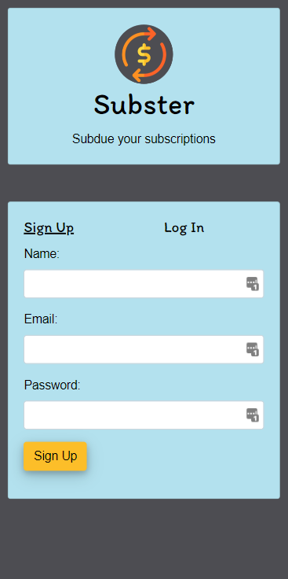

# SUBSTER

## DESCRIPTION
Subster helps you manage your subscriptions. It allows you to add, edit, and track your subscriptions with the following information:
- **Name**: name of the susbcription
- **Cost**: how much the subscription costs
- **Category**: assign the subscription a category
- **Billing Cycle**: how often does the subscription renew
- **Due Date**: when the payment is due
- **Personal star rating**: 1-5 stars for how much you like the subscription

Subster also allows you to track your subscription spending by category with our stat tracker. With the stat tracker you'll be able to see just how much your spending on Video streaming vs. Music streaming and so on.

Subster also allows you to easily filter your subscriptions by cost so you can see which ones are costing you the most.

## USAGE
To use Subster, simply visit https://subster.herokuapp.com/ and sign up for account by entering your user name, email, and password. Subster's interface is intuitive and easy-to-use so you won't have a problem navigating.
- **Add subscription**: To add a subscription, hit the add button to the bottom right of your screen and fill out the following form. Once you have all your information entered, hit save and the subscription will now be added to your dashboard.
- **Edit subscription**: To edit an existing subscription, hit anywhere on a subscription card on your dashboard to open the edit form. Simply edit the information you'd like to change and hit save to update it.
- **Delete subscription**: To delete an existing subscription, hit anywhere on a subscription card on your dashbaord to open the edit form then hit the delete button in the bottom right.
- **View spending stats**: To view your spending by category, hit the bar-graph icon in the top navigation bar. This will open a bar graph which shows your total spending and a breakdown of your spending by category.
- **Filter subscriptions**: To filter your subscriptions by cost, hit the filter button in the top navigation bar and select the option you'd like to filter by.
- **Back button**: Use the back button in the top-left of the navigation bar to return to a previous screen.
- **Log out**: To log out, use the log-out icon in the top-right of the navigation bar.

## LINK
https://subster.herokuapp.com/

## SCREENSHOT

## CREDITS
**Collaborators**
- Aurora Duncan: https://github.com/aurorabrynn
- Juan Vazquez: https://github.com/jvprofits28
